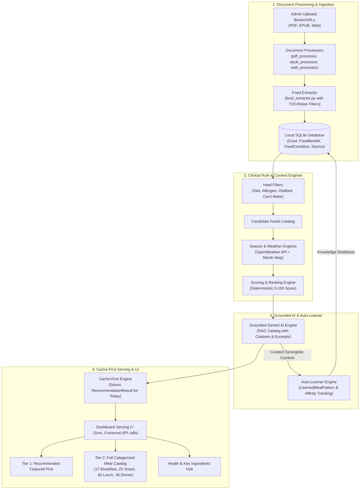

# 03 — System Architecture

## High-Level Overview

NutriWise combines a deterministic clinical nutrition engine with a source-grounded generative AI engine (Gemini) and an autonomous backend feedback-learning engine. Recommendations are 100% grounded in verified health books and documents.



---

## Django App Structure

```
dietary_app/                   ← Django project (settings, main urls, wsgi)
├── core/                      ← Core recommendation & user app
│   ├── models.py              ← Food, UserProfile, RecommendationResult, LearnedMealPattern, UserFoodAffinity
│   ├── views.py               ← Views, cache-first serving, feedback handlers, API endpoints
│   ├── urls.py                ← URL routing
│   ├── forms.py               ← RegisterForm, UserProfileForm
│   ├── admin.py               ← Food & UserProfile admin with inline benefits/conditions
│   └── engines/               ← Recommendation & AI logic
│       ├── hard_filters.py    ← 6-stage clinical safety filter
│       ├── scoring_engine.py  ← Weighted multi-factor scoring (0–100)
│       ├── season_engine.py   ← Seasonal suitability calculator
│       ├── weather_engine.py  ← OpenWeather category classifier
│       ├── meal_combiner.py   ← Balanced macronutrient meal assembler
│       ├── ingredient_matcher.py ← Shared-ingredient alternative finder
│       ├── gemini_engine.py   ← Grounded Gemini RAG curator with multi-model fallback
│       └── auto_learner.py    ← Pattern learner, affinity updater & knowledge distiller
│
├── documents/                 ← Knowledge ingestion app
│   ├── models.py              ← Source model (PDF/EPUB/WEBSITE)
│   ├── views.py               ← process_source view
│   ├── urls.py                ← Document processing URLs
│   ├── admin.py               ← Source admin with 1-click Process button
│   └── processors/            ← File parsers & extractors
│       ├── pdf_processor.py   ← PyMuPDF text extraction + OCR fallback
│       ├── epub_processor.py  ← ebooklib chapter-segmented parser
│       ├── web_processor.py   ← BeautifulSoup cleaner & scraper
│       └── food_extractor.py  ← Noise filtering, canonical mapping & entity extraction
│
├── templates/                 ← Responsive templates
│   ├── base.html              ← Base layout, navbar, messages
│   ├── landing.html           ← Public marketing page
│   ├── onboarding.html        ← 7-step interactive wizard with geolocation
│   ├── dashboard.html         ← Dynamic 2-pane dashboard (all meals + health hub)
│   ├── food_detail.html       ← Complete food dossier & citation modal
│   ├── alternatives.html      ← "Can't make this?" alternative dish recommendations
│   └── auth/
│       ├── login.html
│       └── register.html
│
└── static/
    ├── css/style.css          ← Custom CSS (deep green palette, grid systems, modals)
    └── js/
        ├── onboarding.js      ← Step wizard controller & browser geolocation
        └── dashboard.js       ← Citation modals, hub tab switcher & live ingredient filter
```

---

## URL Map

| Route | View | Description |
|---|---|---|
| `/` | `landing` | Public landing page |
| `/register/` | `register_view` | User signup & auto-login |
| `/login/` | `login_view` | User authentication |
| `/logout/` | `logout_view` | Session termination |
| `/profile/` | `onboarding` | 7-step onboarding wizard & preference editor |
| `/dashboard/` | `dashboard` | Personalized daily diet plan (cache-first) |
| `/food/<id>/` | `food_detail` | Detailed nutritional dossier & exact source quote |
| `/food/<id>/alternatives/` | `food_alternatives` | Ingredient-matched alternatives for missing items |
| `/food/<id>/cant-make/` | `mark_cant_make` | AJAX: exclude food from future recommendations |
| `/food/<id>/feedback/` | `food_feedback` | AJAX: record user feedback for affinity learning |
| `/api/recommendations/` | `api_recommendations` | JSON API: full daily plan |
| `/api/reverse-geocode/` | `api_reverse_geocode` | AJAX: lat/lon coordinates → city/state |
| `/admin/` | `admin.site.urls` | Django admin panel |
| `/documents/process/<id>/` | `process_source` | Admin: trigger document parsing pipeline |

---

## Two-Tier Meal Serving Architecture

Unlike simplistic chatbots that replace the food catalog with only 2–3 items, NutriWise implements a two-tier delivery system:

1. **Tier 1: Synergistic Featured Picks**
   - Curated by Gemini AI or the Auto-Learner engine.
   - Identified by the `⭐ Recommended Pick` badge.
   - Ranked and promoted to the top of each meal slot.
2. **Tier 2: Full Categorized Meal Catalog**
   - Partitioned by authentic culinary times (17 Breakfast, 25 Snack, 40 Lunch, 36 Dinner).
   - Ranked in descending order by the multi-factor scoring engine.
   - 100% accessible to the user, allowing complete flexibility to choose alternatives.

---

## Zero-API-Call Cache-First Protocol

To ensure instant loading times (< 15ms) and eliminate rate limits or 503 errors on page refresh:
1. When `/dashboard/` is loaded, the backend checks for an existing `RecommendationResult` for `(user, today)`.
2. If present, it serves the serialized plan directly from SQLite without invoking Gemini or weather APIs.
3. Plan regeneration occurs only once per day or when explicitly invalidated by profile/source updates.

---

## Ingredient Alternatives Flow

```
User: "Can't make Moong Dal Soup"
              ↓
Extract food's ingredients:
["moong dal", "turmeric", "ginger", "cumin"]
              ↓
Query all other foods (post-hard-filter)
Check ingredient overlap with each
              ↓
Rank by overlap count:
  Moong Dal Khichdi  → 3 shared → shown first
  Dal Tadka          → 2 shared → shown second
  Masoor Dal Soup    → 1 shared → shown third
              ↓
Also show per-ingredient hub:
  "Other dishes using moong dal:" → [...]
  "Other dishes using turmeric:"  → [...]
```
