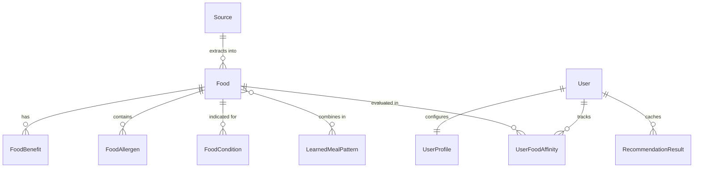

# 04 — Database Schema

## App: `documents`

### Source
Tracks every uploaded book or website.

| Field | Type | Description |
|---|---|---|
| `id` | AutoField | Primary key |
| `title` | CharField(255) | Book title or website name |
| `source_type` | CharField(20) | `PDF`, `EPUB`, `WEBSITE` |
| `author` | CharField(255) | Author name (blank for websites) |
| `publisher` | CharField(255) | Publisher (optional) |
| `year` | IntegerField | Publication year (optional) |
| `url` | TextField | URL if website source |
| `file` | FileField | Uploaded file path (PDF/EPUB) |
| `status` | CharField(20) | `UPLOADED`, `PROCESSING`, `DONE`, `FAILED` |
| `uploaded_at` | DateTimeField | Auto set on create |

---

## App: `core`

### Food
Every food/dish extracted from a source. Created automatically by the extractor.

| Field | Type | Description |
|---|---|---|
| `id` | AutoField | Primary key |
| `name` | CharField(255) | Food name (unique) |
| `regional_names` | TextField | Alternate names (comma separated) |
| `summary` | TextField | First 2–3 sentences from source |
| `category` | CharField(100) | `grain`, `pulse`, `vegetable`, `fruit`, `dairy`, `nut_seed`, `spice`, `oil` |
| `ingredients` | JSONField | `["moong dal", "turmeric", "cumin"]` |
| `diet_types` | JSONField | `["vegan", "vegetarian", "non-vegetarian"]` |
| `meal_types` | JSONField | `["breakfast", "lunch", "dinner", "snack"]` |
| `seasons` | JSONField | `["summer", "monsoon", "winter", "spring", "autumn"]` |
| `weather_categories` | JSONField | `["HOT", "VERY_HOT"]` or `[]` (neutral) |
| `preparation_methods` | TextField | How to prepare (optional) |
| `source` | FK → Source | Which book/website this came from |
| `page_number` | IntegerField | Page in book (null for websites) |
| `chapter` | CharField(255) | Chapter name/ID |
| `source_url` | TextField | URL of source page (for websites) |
| `original_text` | TextField | Exact quote from source (up to 1000 chars) |
| `created_at` | DateTimeField | Auto set on create |

### FoodBenefit
A sourced health/nutrition benefit of a food. Can be extracted from sources or distilled by the AI auto-learner.

| Field | Type | Description |
|---|---|---|
| `id` | AutoField | Primary key |
| `food` | FK → Food | The food this benefit belongs to |
| `benefit` | TextField | Benefit text (up to 500 chars) |

### FoodAllergen
Allergens present in a food.

| Field | Type | Description |
|---|---|---|
| `id` | AutoField | Primary key |
| `food` | FK → Food | The food |
| `allergen` | CharField(100) | `peanut`, `gluten`, `dairy`, `tree_nut`, `soy`, `egg`, `shellfish` |

### FoodCondition
How a food relates to a health condition.

| Field | Type | Description |
|---|---|---|
| `id` | AutoField | Primary key |
| `food` | FK → Food | The food |
| `condition_name` | CharField(100) | `diabetes`, `hypertension`, `cholesterol`, `weight_loss`, `anemia`, `thyroid`, `pcos`, `digestive` |
| `recommendation_type` | CharField(20) | `RECOMMENDED`, `AVOID`, `LIMIT` |
| `reason` | TextField | Explanation text from source or AI distillation |

### UserProfile
All user preferences collected across 7 onboarding steps.

| Field | Type | Step | Description |
|---|---|---|---|
| `user` | OneToOne → User | — | Django auth user |
| `age` | IntegerField | 1 | Age in years |
| `height_cm` | DecimalField | 1 | Height in centimetres |
| `weight_kg` | DecimalField | 1 | Weight in kilograms |
| `activity_level` | CharField(20) | 1 | `sedentary`, `light`, `moderate`, `active` |
| `diet_type` | CharField(50) | 2 | `vegan`, `vegetarian`, `non-vegetarian` |
| `conditions` | JSONField | 3 | `["diabetes", "hypertension"]` |
| `allergies` | JSONField | 4 | `["peanut", "gluten"]` |
| `disliked_foods` | JSONField | 5 | `["bitter gourd", "brinjal"]` |
| `disliked_ingredients` | JSONField | 5 | `["onion", "garlic"]` |
| `disliked_categories` | JSONField | 5 | `["dairy"]` |
| `liked_foods` | JSONField | 6 | `["moong dal", "paneer"]` |
| `liked_ingredients` | JSONField | 6 | `["spinach", "almond"]` |
| `latitude` | DecimalField(9,6) | 7 | From browser geolocation (null if manual) |
| `longitude` | DecimalField(9,6) | 7 | From browser geolocation (null if manual) |
| `location_city` | CharField(100) | 7 | City name (from reverse geocode or manual) |
| `location_state` | CharField(100) | 7 | State name |
| `location_auto_detected` | BooleanField | 7 | True if set via geolocation |
| `cant_make` | JSONField | — | List of Food IDs user marked as can't make |
| `onboarding_complete` | BooleanField | — | True after first onboarding submission |

### RecommendationResult
Cached daily plan per user per day (ensures < 15ms page loads and 0 external API calls on refresh).

| Field | Type | Description |
|---|---|---|
| `id` | AutoField | Primary key |
| `user` | FK → User | The user |
| `generated_date` | DateField | The date this plan covers |
| `result_json` | JSONField | Full serialized meal plan with featured combos |
| `created_at` | DateTimeField | When this was generated |

### LearnedMealPattern
Autonomous backend pattern learning for synergistic food combinations.

| Field | Type | Description |
|---|---|---|
| `id` | AutoField | Primary key |
| `meal_type` | CharField(20) | `breakfast`, `snack`, `lunch`, `dinner` |
| `foods` | ManyToMany → Food | Dishes participating in this synergistic combination |
| `weather_category` | CharField(20) | Weather under which combination was successful |
| `season` | CharField(20) | Season under which combination was successful |
| `diet_type` | CharField(50) | `vegan`, `vegetarian`, `non-vegetarian` |
| `occurrence_count` | IntegerField | Times this combination has been validated |
| `success_rating` | FloatField | Empirical confidence score (0.0 to 1.0) |
| `created_at` | DateTimeField | When pattern was first observed |
| `updated_at` | DateTimeField | Last time pattern was reinforced |

### UserFoodAffinity
Dynamic user taste and cooking habit tracking for personalized scoring adjustments.

| Field | Type | Description |
|---|---|---|
| `id` | AutoField | Primary key |
| `user` | FK → User | The user |
| `food` | FK → Food | The evaluated food item |
| `liked` | BooleanField | Whether user marked this food as a favorite |
| `cooked_count` | IntegerField | Number of times user prepared this dish |
| `times_recommended` | IntegerField | Exposure frequency to prevent recommendation fatigue |
| `affinity_score` | FloatField | Calculated weight modifier (+/- points) |
| `updated_at` | DateTimeField | Last interaction timestamp |

---

## Entity Relationships

---

## Canonical Data Contracts

### 1. `DEFAULT_FOOD_MEAL_TYPES`
Deterministic mapping assigning all canonical foods to realistic meal slots:
- **Breakfast**: Upma, Dosa, Paratha, Bread, Oats, Milk, Curd, Cheese, Chia Seeds, Banana, Apples, Dates, Fig, Mango, Orange, Papaya, Pomegranate (17 items).
- **Snack**: Apples, Banana, Dates, Fig, Grapes, Guava, Kiwi, Pears, Pineapple, Watermelon, Buttermilk, Coconut, Corn, Cucumber, Lemon, Oats, Upma, Chia Seeds, Kheer (25 items).
- **Lunch**: Rice, Roti, Atta, Wheat, Bajra, Barley, Jowar, Maize, Millet, Quinoa, Pulao, Biryani, Paratha, Dal, Lentils, Rajma, Paneer, all hearty vegetables, Ghee, Raita, Curd, Buttermilk (40 items).
- **Dinner**: Roti, Rice, Atta, Wheat, Pulao, Biryani, Dosa, Quinoa, Barley, Jowar, Millet, Dal, Lentils, Rajma, Paneer, light cooked vegetables, Milk, Kheer (36 items).

### 2. `DEFAULT_COMPOSITE_INGREDIENTS`
Ensures multi-ingredient dishes have authentic ingredient breakdowns:
- `Dosa`: `['rice', 'urad dal', 'fenugreek seed', 'ghee']`
- `Upma`: `['semolina', 'mustard seed', 'curry leaves', 'ginger', 'ghee']`
- `Khichdi`: `['rice', 'moong dal', 'turmeric', 'cumin', 'ghee']`
- `Biryani`: `['rice', 'spices', 'ghee', 'onion', 'cardamom', 'cinnamon']`
- `Raita`: `['curd', 'cucumber', 'cumin']`
- `Kheer`: `['rice', 'milk', 'cardamom']`
