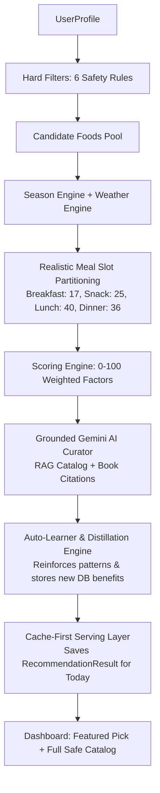

# 06 — Recommendation & Intelligence Engine

## Overview

NutriWise combines a deterministic clinical nutrition engine with a source-grounded generative AI engine (Gemini) and an autonomous backend feedback-learning engine.

Recommendations are **100% source-grounded** in verified books and documents. All decisions are cached locally in SQLite for instant serving (< 15ms).

---

## Engine 1: Hard Filters (`hard_filters.py`)

Removes foods **completely** from the recommendation pool. No partial credit — it is binary in/out:

1. **Diet Type Filter**:
   - `vegan`: strictly vegan dishes.
   - `vegetarian`: vegan + vegetarian dishes.
   - `non-vegetarian`: all dishes.
2. **Allergy Filter**: Removes foods containing any user-declared allergens (`peanut`, `gluten`, `dairy`, `tree_nut`, `soy`, `egg`, `shellfish`).
3. **Health Condition AVOID**: Excludes foods marked `AVOID` for the user's specific health conditions (e.g. high-glycemic foods for diabetics).
4. **Disliked Foods**: Direct food name exclusions (case-insensitive match).
5. **Disliked Ingredients**: Excludes any dish containing an ingredient the user dislikes.
6. **Disliked Categories**: Excludes entire culinary categories (e.g. `dairy`, `grain`).

---

## Engine 2: Season & Weather Context (`season_engine.py` & `weather_engine.py`)

- **Season Engine**: Maps the current month to an Indian dietary season (`winter`, `spring`, `summer`, `monsoon`, `autumn`).
- **Weather Engine**:
  - Uses OpenWeather API with user's geolocation coordinates (or city fallback).
  - Categorizes into: `VERY_HOT` (≥35°C), `HOT` (≥28°C), `NORMAL` (≥20°C), `COOL` (≥12°C), `COLD` (<12°C), `HUMID` (>75%), `RAINY` (codes 500–531).
  - Weather categories award contextual bonus points to foods that balance body temperature.

---

## Engine 3: Realistic Culinary Meal Slot Partitioning

To avoid unrealistic recommendations (e.g. Biryani in breakfast, or light morning fruits in dinner), candidate foods are filtered by authentic culinary times using [`DEFAULT_FOOD_MEAL_TYPES`](file:///mnt/Work/projects/hackday1.0/documents/processors/food_extractor.py#L154):

| Meal Slot | Candidate Pool | Authentic Food Types | Excluded Items |
| :--- | :---: | :--- | :--- |
| **Breakfast** | **17** | Upma, Dosa, Paratha, Oats, Bread, Milk, Curd, Chia Seeds, Banana, Apples, Dates, Mango, Papaya | Biryani, heavy dals, curries, sabzis |
| **Snack** | **25** | Apples, Banana, Pears, Kiwi, Buttermilk, Coconut, Corn, Cucumber, Oats, Upma, Chia Seeds, Kheer | Heavy staples, lentils, curries |
| **Lunch** | **40** | Rice, Roti, Biryani, Pulao, Bajra, Dal, Lentils, Rajma, Paneer, Spinach, Bottle Gourd, Raita | Light breakfast cereals |
| **Dinner** | **36** | Roti, Rice, Khichdi, Dal, Lentils, Spinach, Okra, Cauliflower, Soothing Milk, Kheer | Heavy snacks, breakfast fruits |

---

## Engine 4: Scoring Engine (`scoring_engine.py`)

Each food is scored from 0 to 100 based on clinical and contextual factors:

| Factor | Points | Condition |
|---|---|---|
| Diet compatible | +20 | Passed hard filters |
| Meal slot match | +20 | `meal_type in food.meal_types` |
| Health Condition RECOMMENDED | +20 | Food explicitly indicated for user's condition |
| Season match | +15 | `current_season in food.seasons` |
| Weather match | +10 | `weather_category in food.weather_categories` |
| Liked food | +10 | `food.name.lower() in profile.liked_foods` |
| Liked ingredient | +5 | Any `food.ingredient` in `liked_ingredients` |
| **Maximum Total** | **100** | |

---

## Engine 5: Grounded Gemini AI Engine (`gemini_engine.py`)

When an API key is present, Gemini acts as a clinical dietitian under strict **Retrieval-Augmented Generation (RAG)** constraints:
- **Zero Hallucination Constraint**: Gemini receives a compact grounding catalog of only the candidate foods extracted from uploaded books, complete with book titles, page numbers, and exact text excerpts.
- **Strict Grounding Rule**: Gemini is commanded to *only* select dishes from the candidate list and cite exact sources.
- **Multi-Model Fallback Sequence**:
  1. `gemini-3.6-flash`
  2. `gemini-3.5-flash`
  3. `gemini-flash-latest`
  4. `gemini-2.5-flash-lite`
  *(Bypasses high-demand 503 or 404 errors seamlessly).*
- **Curated Synergies**: Assembles complementary dishes (e.g. `Breakfast: Upma + Banana + Milk`, `Lunch: Pulao + Dal + Raita`) which are tagged with `⭐ Recommended Pick` and promoted to the top of each meal catalog.

---

## Engine 6: Autonomous Backend Auto-Learner (`auto_learner.py`)

Whenever recommendations are generated or validated:
1. **Knowledge Distillation**:
   - Parses the clinical rationale generated by the AI.
   - Automatically inserts newly discovered benefits into `FoodBenefit` and health indications into `FoodCondition` in the database.
2. **Meal Pattern Learning**:
   - Saves synergistic dish combinations into `LearnedMealPattern`.
   - Records success ratings mapped to weather, season, and diet type.
3. **User Taste & Affinity Tracking**:
   - Maintains `UserFoodAffinity` records.
   - Adjusts scoring dynamically over time based on user interactions.

---

## Engine 7: Ingredient Matcher (`ingredient_matcher.py`)

Powers the **"Can't make this? 🔄"** feature:
1. Extracts the ingredients of the unavailable dish.
2. Scans all other post-hard-filter dishes in the database.
3. Calculates shared ingredient overlap counts.
4. Returns:
   - Top alternative complete dishes sharing the most ingredients.
   - Per-ingredient hubs showing other creative ways to use the ingredients already in the user's pantry.

---

## Cache-First Serving Architecture

To guarantee lightning-fast performance (< 15ms) and 0 external network calls on page refresh:
1. When `/dashboard/` loads, it checks for an existing `RecommendationResult` for `(user, today)`.
2. If found, it returns the cached plan immediately.
3. Caching prevents repetitive hits to OpenWeather and Gemini APIs, completely eliminating rate limits during normal browsing.
