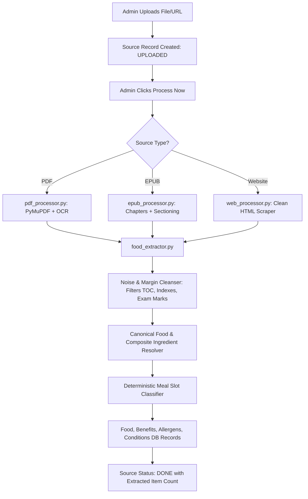

# 08 — Data Pipeline (Admin Upload → Food Records)

## Overview

When the admin uploads a book or website, a single button click triggers the automated ingestion pipeline. No manual data entry is needed — books and research papers are treated as authoritative sources.



---

## Processors

### 1. `pdf_processor.py`
- Uses `PyMuPDF` (`fitz`).
- Reads all pages and structural metadata.
- Captures chapter names from PDF bookmarks / outline hierarchy.
- Cleans marginal noise and headers/footers.
- Falls back to `pytesseract` OCR for scanned pages.
- Returns: `[{"page_number": int, "chapter": str, "text": str, "url": ""}]`.

### 2. `epub_processor.py`
- Uses `ebooklib` + `BeautifulSoup`.
- Parses EPUB document items sequentially.
- Extracts clean chapter and section titles from `<h1>`, `<title>`, or landmark tags.
- Strips styling and navigation artifacts while preserving paragraph structure.
- Returns: `[{"page_number": idx, "chapter": str, "text": str, "url": ""}]`.

### 3. `web_processor.py`
- Uses `requests` + `BeautifulSoup`.
- Fetches target URLs with standard browser headers.
- Strips non-content tags (`<script>`, `<style>`, `<nav>`, `<footer>`, `<aside>`).
- Extracts clean textual content and headings.
- Returns: `[{"page_number": None, "chapter": "", "text": str, "url": original_url}]`.

---

## Noise Filtering & Sanitization (`food_extractor.py`)

To prevent non-food text, revision notes, or book tables of contents from polluting recommendations, the extractor applies strict reject patterns:

```python
REJECT_SECTION_PATTERNS = [
    r'\btable of contents\b',
    r'\bcontents\n',
    r'\bindex\n',
    r'\bbibliography\b',
    r'\bfood spoilage\b',
    r'\bspoilage occurs\b',
    r'\bmicro-organisms\b',
    r'\bunfit to eat\b',
    r'\bfood safety\b',
    r'\bfood hygiene\b',
    r'\buse by date\b',
    r'\bexam practice\b',
    r'\bexam questions\b',
    r'\btest your knowledge\b',
    r'\brevision notes\b',
    r'\banswers to questions\b',
    r'\b\(?\d+\s*marks?\)?',
    r'\bidentify one\b',
]
```

Any paragraph or section matching these patterns is discarded prior to entity recognition.

---

## Canonical Food & Ingredient Resolution

### 1. Canonical Food Matching (`CANONICAL_FOODS`)
Maps common English and Indian food names to standardized entities (e.g. `lauki` → `Bottle Gourd`, `baingan` → `Brinjal`, `palak` → `Spinach`, `moong` → `Dal`).

### 2. Composite Ingredient Resolution (`DEFAULT_COMPOSITE_INGREDIENTS`)
When books describe dishes without a separate ingredients list, the extractor populates verified culinary ingredients:
- **Dosa**: `rice`, `urad dal`, `fenugreek seed`, `ghee`
- **Upma**: `semolina`, `mustard seed`, `curry leaves`, `ginger`, `ghee`
- **Khichdi**: `rice`, `moong dal`, `turmeric`, `cumin`, `ghee`
- **Biryani**: `rice`, `spices`, `ghee`, `onion`, `cardamom`, `cinnamon`
- **Raita**: `curd`, `cucumber`, `cumin`
- **Kheer**: `rice`, `milk`, `cardamom`

---

## Realistic Meal Slot Classification (`DEFAULT_FOOD_MEAL_TYPES`)

To prevent illogical recommendations (such as heavy biryanis in breakfast), foods are assigned canonical meal slots:
- **Breakfast**: 17 items (morning grains, oats, milk, curd, breakfast fruits)
- **Snack**: 25 items (fruits, buttermilk, nuts, light snacks)
- **Lunch**: 40 items (staples, dals, curries, sabzis, raita)
- **Dinner**: 36 items (soothing staples, light dals, cooked vegetables, milk)

---

## Ingestion Flow & Deduplication

1. **Entity Identification**: Checks headings, chapter titles, and first sentences for food subjects.
2. **Summary Extraction**: Pulls the 2–3 most descriptive sentences directly discussing that food's properties.
3. **Clinical Indication & Benefit Parsing**: Extracts therapeutic statements matching `BENEFIT_WORDS` and `CONDITION_KEYWORDS`.
4. **Allergen Detection**: Identifies cross-referenced allergens (`peanut`, `gluten`, `dairy`, `tree_nut`, `soy`, `egg`, `shellfish`).
5. **Deduplication Pattern**:
   ```python
   food, created = Food.objects.get_or_create(
       name__iexact=food_name,
       defaults={'name': food_name}
   )
   ```
   If a food appears in multiple books, its benefits and citations accumulate without creating duplicate entries.
